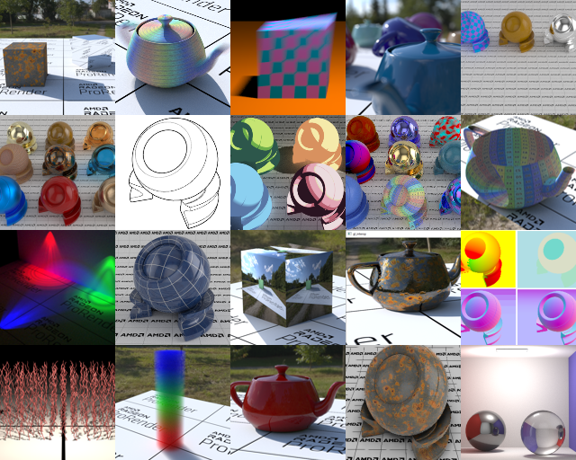

# AMD Radeon:tm: ProRender SDK


AMD Radeon:tm: ProRender is a powerful physically-based rendering engine that enables creative professionals to produce stunningly photorealistic images.
https://www.amd.com/en/technologies/radeon-prorender

This repo contains :
- The AMD Radeon:tm: ProRender library: includes and built binaries.  
  
- [Some tutorials demo samples:](https://github.com/GPUOpen-LibrariesAndSDKs/RadeonProRenderSDK/tree/master/tutorials#readme)  


## Install Precompiled Kernels

Since 3.01.00, for Northstar the default render backend is HIP ( instead of OpenCL ). \
The main difference is that compute kernels are now precompiled by us. They must be downloaded from a submodule.\
Note that for now you can still use the OpenCL backend ( with `RPR_CREATION_FLAGS_ENABLE_OPENCL` in `rprCreateContext` ). However we don't recommend it as in the future we may put less resource to support this backend.\
Download the precompiled kernels with the command: 
```
git submodule update --init --recursive
```

The precompiled kernels folder can be modified with `RPR_CONTEXT_PRECOMPILED_BINARY_PATH`. ( for its usage, check the tutorials ).

If precompiled kernels are not found,`RPR_ERROR_SHADER_COMPILATION` is returned by `rprContextRender`.

## Building and running the Tutorials

On Visual Studio:
```
> cd tutorials
> ..\premake5\win\premake5.exe vs2022
( replace vs2022 by the version of your choice: vs2019, vs2017... )
then open tutorials/Tutorials.sln
```

On Ubuntu 18:  
Dependencies on Linux for the tutorials: GLEW, GLUT, Pthread.
```
> cd tutorials
> sudo chmod +x ../premake5/linux64/premake5
> ../premake5/linux64/premake5 gmake
> make -j config=release_x64
```

On Centos 7:  
Same dependencies than Ubuntu.  
You should also update your GCC, we have tested it with devtoolset-10 (yum install devtoolset-10)
```
> cd tutorials
> sudo chmod +x ../premake5/linux64/premake5
> ../premake5/linux64/premake5 --centos gmake
> source scl_source enable devtoolset-10
> make -j config=release_x64
```

On MacOS:
```
> cd tutorials
> sudo chmod +x ../premake5/osx/premake5
> ../premake5/osx/premake5 gmake
> make -j config=release_x64
```

To run a demo, just select the executable and start it, example:
```
> cd tutorials/Bin
> ./05_basic_scene64
this demo generates the rendering output images: 05_00.png, 05_01.png, 05_02.png, 05_03.png
```

See detailed documentation at 
https://radeon-pro.github.io/RadeonProRenderDocs/sdk/tutorials.html

## Additional Info

- Radeon:tm: ProRender GPUOpen web site
https://gpuopen.com/radeon-pro-render/

- Radeon:tm: ProRenderSDK documentation
https://radeon-pro.github.io/RadeonProRenderDocs/sdk/about.html


